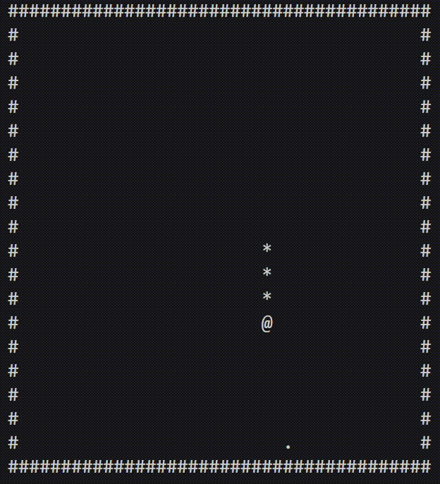

# GreedySnake
GreedySnake within 100 lines in C++, single-file, fully commented, featuring a custom doubly linked list. 用100行代码实现贪吃蛇（C++）,单文件带详细注释，手写双向链表。  

  

# Introduction  
Implement the Snake game using a linked list. When the snake moves, a new head node is added while a tail node is deleted. When the snake eats food, only the head node is updated at the food position.  
more details in code comments.   
Some techniques used:  
1. kbhit(): A non-STL function to read keyboard input, relying on the header file #include <conio.h>.  

2. Control the screen using escape sequences:  
Print a character at a specific position:  
cout << "\033[" << y << ";" << x << "H" << c;  
Clear screen:  
cout << "\x1b[2J";  
Hide the console cursor:  
cout << "\e[?25l";  

# History  
version 1.0:  
Implemented using classes and a singly linked list.  
--20231225  
version 2.0:  
By removing classes and using a doubly linked list, redundant functionality and code were eliminated, and the time complexity for movement and condition checks was optimized from O(n) to O(1).      
--20240706  
version 3.0:    
Further optimize the code.      
--20250117  

# 介绍
用链表实现贪吃蛇，移动时新增一个头节点，同时删除一个尾节点；吃到食物时只在食物位置更新头节点。  
代码里面有详细注释。  

使用的一些技巧      
1. `kbhit()`：非stl，读取键盘输入,依赖头文件`#include <conio.h>`  

2. 使用转义序列控制屏幕：    
在某处打印字符：`cout << "\033[" << y << ";" << x << "H" << c;`  
清屏：`cout << "\x1b[2J";`   
隐藏控制台光标：`cout << "\e[?25l";`  

# 历史  
version1.0 :     
用类实现功能，单向链表    
--20231225     
version2.0 :   
不使用类，使用双向链表，删除了冗余功能和代码，把移动和判断的时间复杂度从O(n)优化到O(1)   
--20240706   
version 3.0:   
进一步优化代码  
--20250117  
